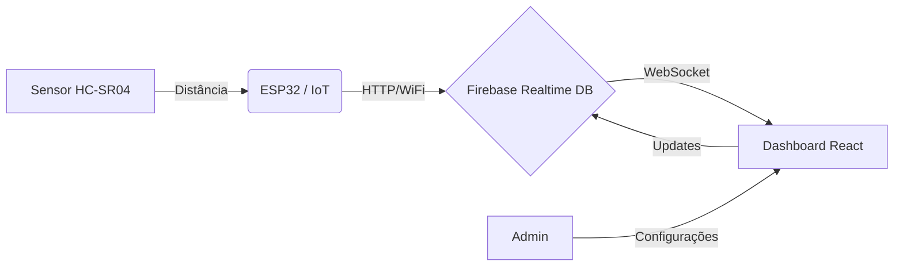

# 🗑️ Automate | Smart Waste Monitor

> **Sistema Integrado de Gestão de Resíduos Urbanos via IoT**

    

O **Automate** é uma solução de *Smart City* projetada para otimizar a coleta de lixo. Através de sensores IoT instalados em lixeiras e um dashboard web em tempo real, gestores podem monitorar níveis de ocupação, evitando transbordamentos e otimizando rotas de coleta.

-----

## 📋 Índice

1. [Sobre o Projeto](#-sobre-o-projeto)
2. [Arquitetura da Solução](#-arquitetura-da-solução)
3. [Funcionalidades Implementadas](#-funcionalidades-implementadas)
4. [Stack Tecnológica](#-stack-tecnológica)
5. [Como Executar o Projeto](#-como-executar-o-projeto)
6. [Hardware e Conexões](#-hardware-e-conexões)
7. [Roadmap Futuro (Próximos Passos)](#-roadmap-futuro)

-----

## 📖 Sobre o Projeto

A gestão de resíduos sólidos é um desafio logístico. Coletas agendadas sem dados reais geram dois problemas:

1.  **Ineficiência:** Caminhões recolhendo lixeiras vazias.
2.  **Insalubridade:** Lixeiras transbordando antes do horário da coleta.

O **Automate** resolve isso instalando um "olho digital" (Sensor Ultrassônico) em cada lixeira, conectado à nuvem, permitindo uma gestão baseada em dados reais.

-----

## 🏗 Arquitetura da Solução

O sistema opera em um fluxo de dados contínuo (End-to-End):



1.  **Coleta:** O sensor mede a distância do topo da lixeira até o lixo (espaço vazio).
2.  **Transmissão:** O ESP32 processa e envia os dados brutos via Wi-Fi.
3.  **Armazenamento:** O Firebase recebe os dados e sincroniza em tempo real.
4.  **Visualização:** O Frontend React aplica a lógica matemática inversa (`Total - Vazio = Cheio`) e exibe o status.

-----

## ✅ Funcionalidades Implementadas

### 1\. Monitoramento em Tempo Real 🟢🟡🔴

  - Visualização instantânea do nível de cada lixeira.
  - **Feedback Visual Semântico:**
      - **Verde:** Nível Normal (\< 50%).
      - **Amarelo:** Nível de Atenção (50% - 79%).
      - **Vermelho:** Nível Crítico (\> 80%) com alerta pulsante.
  - Atualização automática via WebSocket (sem necessidade de recarregar a página).

### 2\. Gestão de Sensores (CRUD) ⚙️

  - **Cadastro:** Registro de novas lixeiras vinculando o ID físico do Hardware (ex: `Lixeira0`) a um nome amigável (ex: "Praça da Sé").
  - **Calibração:** Definição da **Altura Total** da lixeira pelo software, permitindo usar o mesmo sensor em lixeiras de tamanhos diferentes.
  - **Geolocalização:** Cadastro de Latitude/Longitude para referência.
  - **Edição/Exclusão:** Correção de dados e remoção de sensores obsoletos.

### 3\. Experiência do Usuário (UX) 🎨

  - Interface moderna e responsiva (Mobile-first).
  - **Dark Mode** automático/integrado.
  - Tratamento de erros (Página 404, Feedbacks de salvamento).
  - Link direto para visualização no **Google Maps**.

-----

## 💻 Stack Tecnológica

### Frontend (Web)

  - **Framework:** [React 19](https://react.dev/) + [Vite](https://vitejs.dev/)
  - **Linguagem:** TypeScript
  - **Estilização:** [Tailwind CSS v4](https://tailwindcss.com/)
  - **Roteamento:** React Router v7
  - **Ícones:** Lucide React / Iconify
  - **Qualidade de Código:** Biome.js

### Backend & Cloud

  - **Database:** Firebase Realtime Database (NoSQL)
  - **Infraestrutura:** Google Cloud Platform (via Firebase)

### Hardware (IoT)

  - **Microcontrolador:** ESP32 DevKit V1
  - **Sensor:** HC-SR04 (Ultrassônico)
  - **Linguagem:** C++ (Arduino Framework)
  - **Bibliotecas:** `WiFi.h`, `FirebaseClient.h`

-----

## 🚀 Como Executar o Projeto

### Pré-requisitos

  - Node.js (v18+)
  - Conta no Firebase

### 1\. Configuração do Código (Frontend)

```bash
# Clone o repositório
git clone https://github.com/seu-usuario/automate.git

# Entre na pasta
cd automate

# Instale as dependências (Recomendado usar npm para evitar conflitos de lock)
npm install

# Inicie o servidor de desenvolvimento
npm run dev
```

### 2\. Configuração das Chaves (Firebase)

Crie um arquivo `src/firebaseConfig.ts` e adicione suas credenciais:

```typescript
import { initializeApp } from "firebase/app";
import { getDatabase } from "firebase/database";

const firebaseConfig = {
  apiKey: "SUA_API_KEY",
  authDomain: "seu-projeto.firebaseapp.com",
  databaseURL: "https://seu-projeto-default-rtdb.firebaseio.com",
  projectId: "seu-projeto",
  storageBucket: "seu-projeto.appspot.com",
  messagingSenderId: "SEU_ID",
  appId: "SEU_APP_ID"
};

const app = initializeApp(firebaseConfig);
export const db = getDatabase(app);
```

[Link do Projeto](https://console.firebase.google.com/project/automate-52c0d/overview)

-----

## 🔌 Hardware e Conexões

Esquema de ligação do **ESP32** com o sensor **HC-SR04**:

| Sensor HC-SR04 | ESP32 (GPIO) |
| :--- | :--- |
| **VCC** | VIN (5V) |
| **GND** | GND |
| **Trig** | GPIO 13 (Lixeira 0) |
| **Echo** | GPIO 12 (Lixeira 0) |

> *Nota: Para múltiplas lixeiras, repita a lógica de Trig/Echo em outras portas digitais definidas no `Sensors.h`.*

-----

## 🔮 Roadmap Futuro

O projeto atual representa um **MVP (Produto Mínimo Viável)** robusto. Abaixo estão as funcionalidades planejadas para a versão 2.0 (Fase de Evolução):

### 🛡️ Segurança & Acesso

  - [ ] **Autenticação:** Implementar tela de Login (Firebase Auth) para que apenas administradores autorizados possam cadastrar/editar lixeiras.

### 📊 Inteligência de Dados

  - [ ] **Histórico:** Gráficos de evolução de lixo nos últimos 7 dias.
  - [ ] **Predição:** Usar dados históricos para prever quando uma lixeira ficará cheia (Machine Learning simples).

### 🗺️ Visualização Avançada

  - [ ] **Mapa Interativo:** Substituir os links de texto por um mapa embutido (Leaflet/Mapbox) com pinos coloridos (Verde/Vermelho) espalhados pela cidade.

### 🔋 Otimização de Hardware

  - [ ] **Deep Sleep:** Otimizar o código do Arduino para "dormir" entre leituras e economizar bateria.
  - [ ] **Case Impermeável:** Migrar para sensores JSN-SR04T (à prova d'água) para uso externo real.

-----

## 📄 Licença

Este projeto está sob a licença MIT - sinta-se livre para contribuir\!

**Desenvolvido com 💚 para Cidades Inteligentes.**